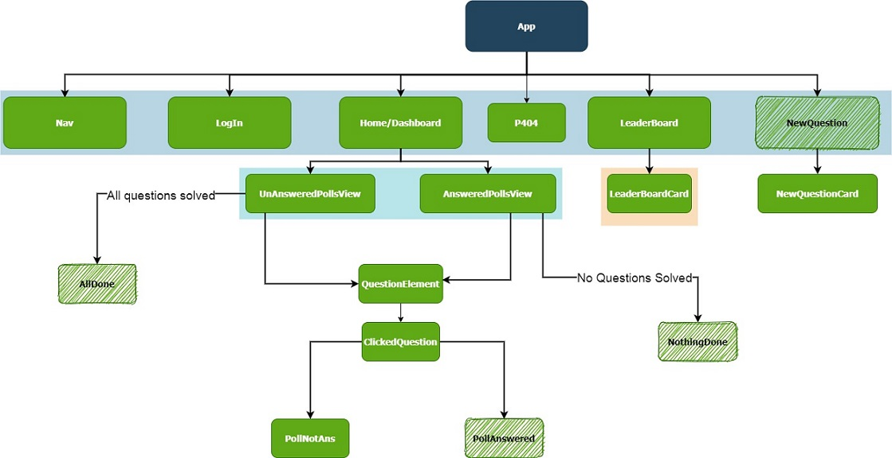
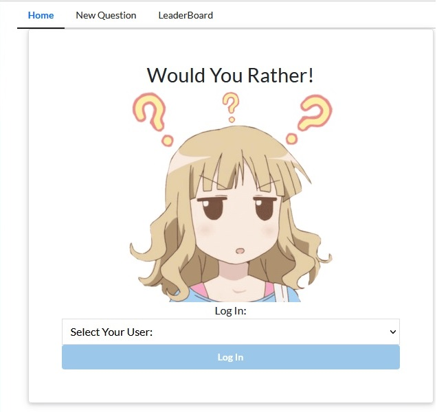
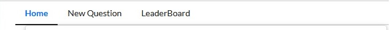
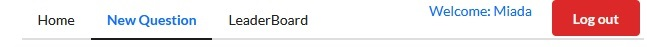
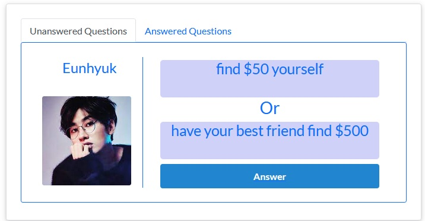
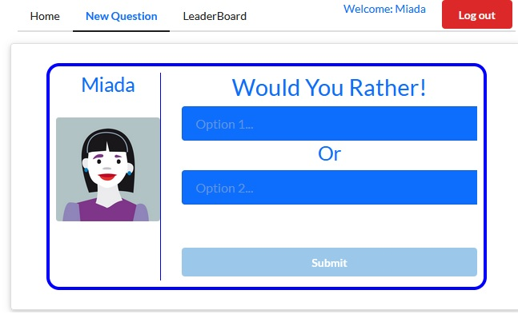
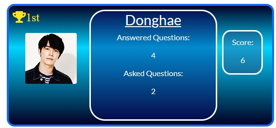
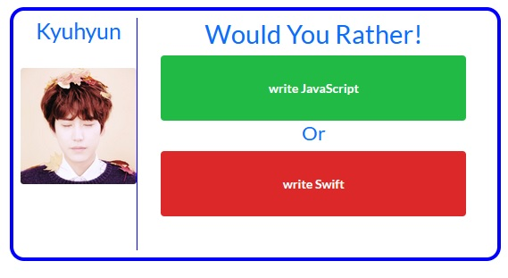
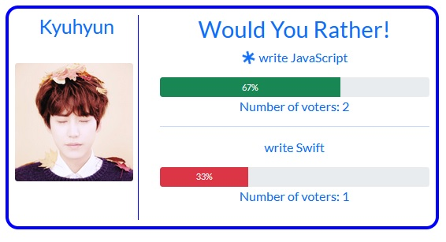

# Would You Rather Project
## Project Overview:

In the "Would You Rather?" Project, you'll build a web app that lets a user play the “Would You Rather?” game. The game goes like this: A user is asked a question in the form: “Would you rather [option A] or [option B] ?”. Answering "neither" or "both" is against the rules.

In your app, users will be able to answer questions, see which questions they haven’t answered, see how other people have voted, post questions, and see the ranking of users on the leaderboard.

## Table Of Content:
- [Install And Start](#install_start)
- [App Structure](#structure)
- [Login Page](#login)
- [Navigation Bar](#nav)
- [Home Page](#home)
- [New Question](#add)
- [Leaderboard](#leader)
- [Question](#question)
- [Technologies Used](#tech)
- [Problems](#problems)
- [External Resources](#external)

## <a name="install_start"> Install And Start: </a>:
- To Install project:
    - npm install
- To Launch:
    - npm/yarn start
- The Project run by default on: 
    - localhost:3000

## <a name="structure">App Structure:</a>
- Diagram(using draw.io)

- The App have 4 main views/pages:
    - Login Page
    - Home Page
    - New Question Page
    - Leaderboard Page

## <a name="login">Login Page:</a>

- The first page the user sees after starting the project.
- The application allows the user to log out and log back in. 
- The user should be logged in to submit new polling questions, vote, and view the leaderboard.
- Once the user logs in, the home page is shown.
- Whenever the user types something in the address bar, the user is asked to log in before the requested page is shown.

## <a name="nav">Navigation Bar:</a>

- If user is not logged in the available options would be(But to actually see any of those target pages the user must log in first):
    - Home
    - New Question
    - Leaderboard

- If user is logged in:
    - Home
    - New Question
    - Leaderboard
    - Name of logged in user
    - Logout button.

## <a name="home">Home Page:</a>
 

- By Default Unanswered Questions tab is selected.
- User can navigate between the Answered/Unanswered Questions by using the tab they want.
- The polls in both categories are arranged from the most recently created (top) to the least recently created (bottom).
    - Unanswered Questions Tab:
        - If all questions answered:
            - Page informing user that all questions have been answered
            - Link added to redirect user to adding a new question.
        - If there are still non-answered questions:
            - A list of unanswered questions will be shown where user can press on any question they want to answer
    
    - Answered Question Tab:
        - If No question is answered:
            - Page informing user that no questions answered yet
        - If the user have question(s) answered:
            - List of answered questions so user can press any of them

## <a name="add">New Question:</a>

- A card with the username and img will be shown, the user can enter the options for the question they want.
- If any of those 2 question fields(or both) are empty the submit button will be disabled.
- After submitting the 2 fields and pressing submit the user will be redirected to the Home Page.

## <a name="leader">Leaderboard:</a>

- The leaderboard contains list of WYR users.
- The user card contains:
    - Username
    - User Img
    - Number of Questions Asked
    - Number of Questions Answered
    - Score(Number of Questions Asked+Number of Questions Answered)
    - The top 3 users in the leaderboard will have an icon with their rank above their img.

## <a name="question">Question:</a>

- The question id can be seen in the URL bar (localhost:3000/questions/:question_id)
- If the user entered the question id directly inside the URL:
    - The user will be asked to login(even if already logged in).
        - If question doesnt exist a 404 page will be shown
        - If question exist:
            - If question is not answered:
                - The options are shown for user to pick
                - After picking the choice the [question already answered ](#ans)page will be shown
            

            - <a name="ans">If question already answered</a>:
                - User selection(marked with a spinner)
                - A bar to show percentage of each option
                - Number of voters of each option
            
               

## <a name="tech">Technologies Used:</a>:
- HTML 
- CSS
- Javascript
    - React Library
- Redux
- FB (Create React App)

## <a name="problems">Problems:</a>:

- Installing react-redux-loading kept on throwing errors to me(i think it is a compatibility issue), so had to handle loading and saving to API manually.
    - components>>NewQuestionCard
    - components>>PollNotAns

## <a name="external">External Resources:</a>:

- [Reactstrap](https://reactstrap.github.io/)
    - To use:
        - npm i --save bootstrap
        - npm i --save reactstrap
        - root index:
            - import 'bootstrap/dist/css/bootstrap.min.css';
        - Component where it is needed:
            - import { compName } from "reactstrap";

- [Semantic UI](https://semantic-ui.com/)

- ReduxDevTools

- Images:
    - [PngFind](https://www.pngfind.com/)
    - [Pikpng](https://www.pikpng.com/)
    - [pngitem](https://www.pngitem.com/)
    - Google

*** 
Thanks for your time: Miada Gamal
 ***

